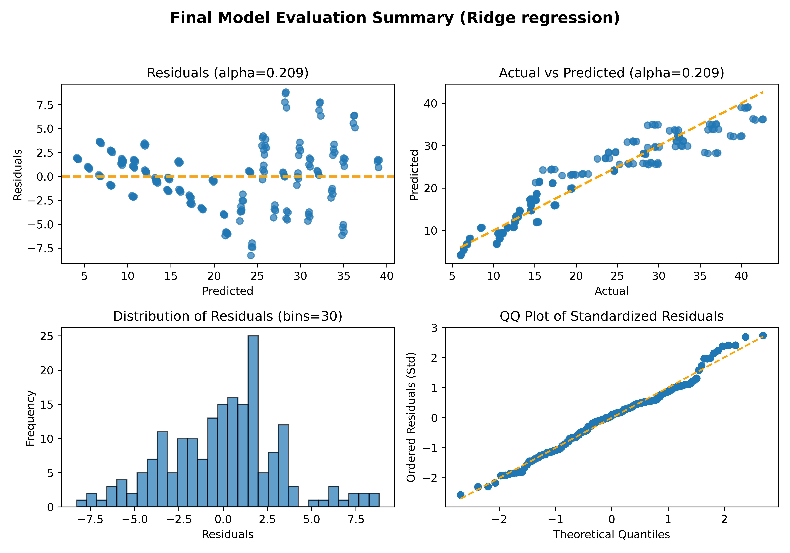

# Ridge regression

Framework for a ridge regression model that predicts heating load.

`ridge_regression.py` tunes the hyperparameter `alpha` using nested cross-validation.

`final_model.py` trains the final model using the full data set and the identified `best_alpha`. This script also outputs the diagnostic plot `residuals_analysis.png` to review the residuals.

Tuning and prediction results can be found in the log files `training.log` and `final_model.log`.

## Dataset

Tsanas, Athanasios and Angeliki Xifara. 2012. Energy Efficiency. UCI Machine Learning Repository. <https://doi.org/10.24432/C51307>.
